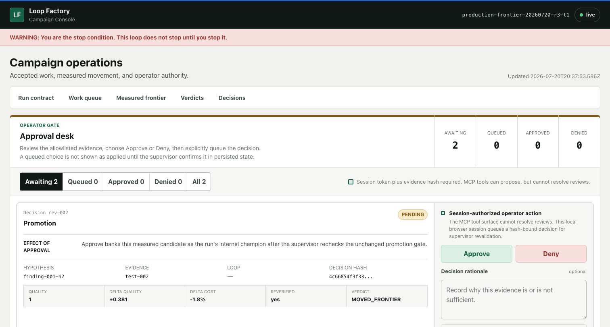

# Loop Factory

## Make AI agents prove they got better.

Loop Factory is a local MCP server and autonomous CLI that continuously finds
workflows, proposes improvements, tests the original against the challenger,
and sends measured winners to an approval desk.

It is a deterministic slop terminator: models can propose anything, but claims,
self-reported scores, and confident summaries do not count as progress.



## What It Does

```text
mine a real workflow
        |
freeze the original and benchmark
        |
generate competing revisions
        |
test original, challenger, and controls
        |
re-open saved outputs and recalculate the result
        |
queue measured winners for Approve or Deny
        |
continue to the next target until the operator stops it
```

Pending reviews do not pause the factory. A model cannot promote itself. The
operator is the only stop condition.

## Recursive Harness V2

The current build can also improve the mechanism it uses to propose later
improvements. It does this conservatively:

1. one model proposes at most three typed changes to a deterministic mechanism;
2. five tasks calibrate real candidate movement against an irrelevant sham;
3. only a qualified calibration unlocks five untouched confirmation tasks;
4. three replicates per arm produce 60 calls per stage;
5. the verifier reopens every saved prompt, receipt, candidate, and evaluation;
6. a passing descendant enters bounded routing, never canonical promotion; and
7. the next generation receives an immutable receipt explaining the measured
   mechanism, result, placebo movement, regressions, and evidence hashes.

Context allocation can move only 10% after five valid token observations.
Mechanism records are never deleted or summarized for savings; an oversized
prompt may use a hash-bound, lossless index while full bytes remain on disk.
Related, adjacent, failure-derived, wildcard, and permanent no-memory control
slots remain deterministic and replayable.

One statistical boundary is deliberately explicit: five confirmation clusters
have a minimum attainable sign-test p-value of `0.03125`. A Bonferroni plan with
two or more generations therefore records qualifying children as development
signals but cannot admit them to routing. `npm run verify:recursive-null`
reports this as a diagnostic rather than calling zero admissions a calibrated
success. Changing that boundary requires a separately reviewed scientific
design, not a quiet implementation tweak.

This implementation is locally tested. It is not presented as scientifically
proven until a separately approved live campaign passes the same verifier on
real disjoint tasks. See [Recursive Harness V2](docs/RECURSIVE_HARNESS_V2.md).

## VNext: Learn How To Improve

The experimental VNext pipeline turns a measured failure into a bounded,
replayable experiment:

1. retrieve both useful and failed precedents that existed at the decision time;
2. optionally discover primary public research in a fresh browser-only process;
3. capture and hash the exact source bytes with a separate deterministic worker;
4. build a compact dossier, propose one hypothesis, and ask a fresh falsifier to
   reject, revise, or test it;
5. generate one candidate through a native, reflective-Pareto, bounded-skill,
   bank-recombination, or disabled-by-default code strategy; and
6. send measurements, never model opinions, to the frozen statistical gate.

The model can propose context and edits. It cannot alter the evaluator, hidden
tasks, sham, verifier, statistics, model authority, or promotion rules. The
implementation passes local replay and isolation tests; matched live B0-B6
ablations, one exact-candidate disjoint transfer, and one external-custodian
final result are still required before claiming generalized improvement. The
transfer and final runners cannot research, retrieve, revise, regenerate,
import, activate, or promote the selected candidate. See
[the VNext handoff](docs/loop-factory-vnext/14_FINAL_HANDOFF.md).

## What The Final Run Proved

The final Build Week run found a real workflow for deciding whether a revision
should move forward, then tested two meaningful rewrites from scratch.

| Procedure | Quality | Mean CLI tokens | Quality change | Cost change |
|---|---:|---:|---:|---:|
| Original | `0.6190` | `61,270.3333` | baseline | baseline |
| H1: clear acceptance rules | `1.0000` | `60,180` | `+0.3810` | `-1.78%` |
| H2: evidence and recheck rules | `1.0000` | `60,193.3333` | `+0.3810` | `-1.76%` |

`1.0000` is the maximum score on that run's narrow, frozen task rubric. It does
not mean the loop, model, or system is universally perfect.

The run used:

- `12` real model calls;
- exact `gpt-5.6-sol` at high reasoning;
- zero retries and zero exit failures;
- `12` isolated workspaces;
- `724,453` CLI-reported tokens;
- `34/34` saved-file hash checks; and
- a separate verifier that returned `PASS`.

Both revisions remain pending in the approval desk. No promotion was recorded.
H1 is the measured recommendation, not an automatic decision.

[Read the production report](submission/evidence/production-frontier-20260720/FINAL_PRODUCTION_REPORT.md)
or compare the
[original](submission/evidence/production-frontier-20260720/original-loop.md)
with the
[recommended revision](submission/evidence/production-frontier-20260720/improved-loop-h1.md).

## Verify It In 30 Seconds

Requirements: Node.js 18 or newer.

```bash
git clone https://github.com/alexalexalex222/Loop-Factory-mcp-public.git
cd Loop-Factory-mcp-public
npm run verify:submission
```

Expected top-level result:

```json
{
  "status": "PASS"
}
```

This command makes no model call. It:

1. re-derives a public 16-call controlled proof run from saved transcripts;
2. checks five paired challenger wins, zero wins by the irrelevant-edit
   control, and zero regressions;
3. verifies model selection, retries, isolated workspaces, output formats,
   token counts, and file hashes; and
4. integrity-checks the final production evidence.

It exits nonzero if any gate fails.

## Current Model Policy

The default policy now uses the current routes exercised by this project:

| Role | Default |
|---|---|
| Primary worker | `gpt-5.6-sol` |
| Test routes | `gpt-5.6-sol`, `claude-fable-5`, `gpt-5.6-terra` |
| Drafting and gate checks | `claude-fable-5`, `gpt-5.6-sol` |
| Independent judge | `claude-fable-5` |

Claude workers are launched with an explicit `--model` flag. Codex workers are
launched with an explicit `-m` flag. The operator may replace the full policy
when starting a run. Strict proof runs can lock every call to one
exact model, as the final GPT-5.6 Sol production run did.

## Optional Improvement Memory

Loop Factory records deterministic improvement receipts and can use them in two
off-by-default modes. `shadow` writes an auditable ranking packet without
changing execution. `active-canary` routes only reverified, control-complete
harvest evidence before hypothesis generation, preserves a permanent no-memory
control, compiles executable mechanisms before registration, and binds every
affected hypothesis to the exact route, policy, capsule, treatment, and
interface hashes.

Active routing is not permission to call a result an improvement. Automatic
banking remains closed until the supervisor receives sealed paired
baseline/routed/sham evidence with zero sham movement, zero control regressions,
complete transfer evidence, and every existing promotion gate. The operator API
accepts persisted measurement references, never caller-supplied quality numbers.
A restart
resumes registered pending hypotheses without rerunning the frozen baseline;
unused routes require an immutable operator retirement receipt.

The operator can also import a persisted V4 executable-canary pass. The import
reruns the independent verifier, pairs only the shared confirmation tasks, and
stores a routing-only receipt; it never updates policy, promotion, or canonical
loop bytes. Automatic import additionally requires a predeclared sealed config
flag. When that flag is present, the executable-canary CLI performs the import
before reporting closed-loop success. A causal PASS whose verifier-owned import
fails exits nonzero; a valid causal FAIL remains evidence and imports nothing.

The autonomous campaign CLI also persists a private, hash-chained parent
scheduler ledger. Queue state, the active target and deterministic child run ID,
coverage, counters, deduplication sets, promotion state, and idle/mining epochs
survive a cold process restart. The exact campaign config is hash-bound to every
checkpoint, completed child receipts are reopened without another worker call,
and config or ledger drift fails closed.

The feature is off by default. Enable it in `initialize_loop_run`:

```json
{
  "config": {
    "metaLearning": {
      "enabled": true,
      "mode": "shadow",
      "policyId": "meta-policy-v1",
      "seed": "run-bound-safe-id"
    }
  }
}
```

Autonomous campaign configs place the same object under
`engineConfig.metaLearning`. See
[the improvement memory contract](docs/IMPROVEMENT_MEMORY.md) for receipt,
partition, fallback, privacy, and claim boundaries, and
[the adaptive intelligence contract](docs/ADAPTIVE_INTELLIGENCE_V1.md) for the
active-canary safety boundary.

## Run The Factory

The autonomous driver is opt-in because it launches real model workers:

```bash
SUPER_LOOP_ALLOW_EXEC=1 npm run run-campaign -- \
  --config examples/campaign.json \
  --stop-file ./STOP \
  --dashboard-port 8787
```

Open `http://127.0.0.1:8787` for the campaign and approval dashboard.

Create the stop file when you want the factory to stop:

```bash
touch STOP
```

The example campaign uses GPT-5.6 Sol, Fable 5, and GPT-5.6 Terra. Edit the
config before running if you want a narrower policy or a different target.

### State and operating system support

`SUPER_LOOP_HOME` is always authoritative. A source checkout keeps the legacy
`<package>/.super-loop` location when it already exists; a fresh packed install
uses a writable per-user location:

| Platform | Fresh installed state path |
|---|---|
| macOS | `~/Library/Application Support/Loop Factory` |
| Linux | `$XDG_STATE_HOME/loop-factory`, or `~/.local/state/loop-factory` |
| Windows | `%LOCALAPPDATA%\Loop Factory` |

The POSIX command above also works on macOS and Linux. On PowerShell:

```powershell
$env:SUPER_LOOP_ALLOW_EXEC = "1"
node scripts/run-campaign.mjs --config examples/campaign.json --stop-file .\STOP
New-Item -ItemType File .\STOP
```

On Windows Command Prompt:

```bat
set "SUPER_LOOP_ALLOW_EXEC=1"
node scripts\run-campaign.mjs --config examples\campaign.json --stop-file .\STOP
type nul > .\STOP
```

`npm run package:smoke` packs the project, installs it into a clean path with
spaces, handshakes the installed MCP server, checks both loop hashes and every
tool, and round-trips isolated state. The public core at commit `db1b5ac` passed
that contract on GitHub-hosted Windows, macOS, and Ubuntu runners, plus Node 22
and 24 on Ubuntu. This combined VNext tree must pass the same workflow before
it is described as cross-platform verified; preserving the workflow is part of
the integration contract.

## Use It As An MCP Server

Point an MCP-capable host at `src/server.mjs`:

```json
{
  "mcpServers": {
    "loop-factory": {
      "command": "node",
      "args": ["/absolute/path/to/Loop-Factory-mcp-public/src/server.mjs"],
      "env": {
        "SUPER_LOOP_HOST": "codex"
      }
    }
  }
}
```

Start with `initialize_loop_run`. Loop Factory asks for the goal, starting
path, benchmark, limits, and model policy once, then persists the campaign.

## What It Refuses To Trust

- A worker saying its own revision is better.
- A score typed by a model instead of derived by the tool.
- A challenger tested against a conveniently weak baseline.
- A result without both the original output and the parsed result.
- A requested model that differs from the sealed plan.
- A measured win that has not been checked again from saved evidence.
- A model attempting to approve or promote its own work.

## Useful Commands

| Command | Purpose |
|---|---|
| `npm run verify:submission` | Re-run the public judge proof with no model call |
| `npm test` | Run the complete test suite |
| `npm run verify` | Verify the bundled loop hashes |
| `npm run verify:hashes` | Verify the public source-checkout and artifact hash manifest |
| `npm run verify:recursive-null` | Replay the deterministic repeated-selection null simulation |
| `npm run demo` | Generate a deterministic local demo |
| `npm run package:smoke` | Test the packed install and portable state boundary |
| `npm run run-campaign -- --config <file>` | Start the autonomous factory |
| `npm run verify:run -- --home <home> --run <id>` | Recompute a persisted production run |
| `npm run judge:gpt56-sol` | Run the optional exact-model enforcement proof |

## Evidence

- [Judge guide](docs/JUDGE_GUIDE.md)
- [Production evidence](submission/evidence/production-frontier-20260720/)
- [Portable controlled proof run](submission/evidence/context-isolation-canary-20260719/)
- [Real-test design](docs/REAL_TEST_5X10.md)
- [Improvement memory contract](docs/IMPROVEMENT_MEMORY.md)
- [Submission copy](docs/BUILD_WEEK_SUBMISSION.md)
- [Video script](docs/BUILD_WEEK_VIDEO.md)

## Honest Boundaries

- The production evidence publishes privacy-safe results and hashes, not raw
  provider transcripts containing machine-specific paths.
- The public controlled proof run includes transcript-backed evidence and is
  the fully portable no-model verification path.
- The production run proved one mined workflow improved under its frozen
  benchmark. It does not prove every possible workflow will improve.
- Model availability depends on the operator's authenticated Claude Code and
  Codex installations.
- Hosted CI proves the core and fake-provider boundaries; it does not prove
  every authenticated third-party CLI on every operating system.
- Paid VNext dispatch barriers require file-and-directory power-loss durability.
  They are supported on macOS and Linux; Windows refuses before state mutation
  until a native directory-flush adapter is implemented and verified.
- The disabled-by-default code-candidate executor is macOS-only and refuses on
  Linux and Windows until an equally strong native sandbox is implemented.
- Loop Factory records a winner only after operator approval. It does not
  overwrite canonical user files.

## License

MIT
