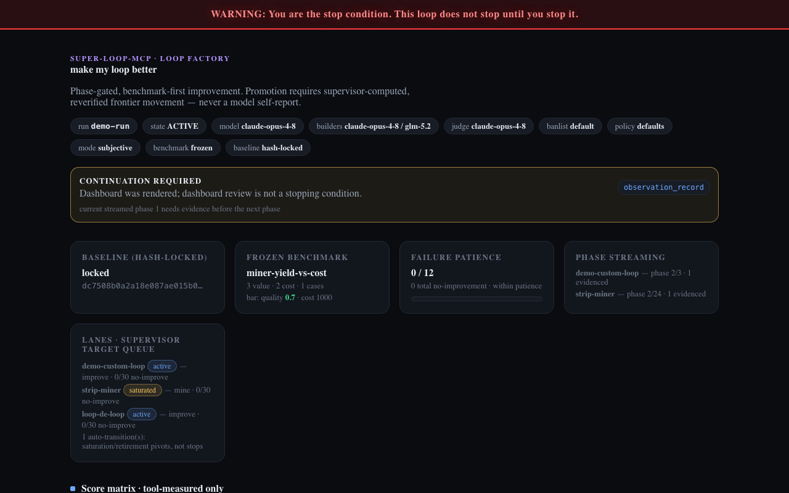

# Loop Factory

**AI agents that improve themselves tend to lie, skip steps, and stop early.** Loop Factory is the local supervisor that won't let them: it streams improvement procedures one phase at a time, measures results from sealed bytes, and never calls a campaign "done" until *you* stop it.

`local-first` · `zero dependencies` · `Node ≥18` · `MCP over stdio` · package name `super-loop-mcp` (git-install; `"private": true`)



---

## Quickstart

```bash
git clone https://github.com/alexalexalex222/Loop-Factory-mcp-public.git
cd Loop-Factory-mcp-public
npm test       # full node:test suite — no install, zero deps
npm run demo   # live stdio campaign (46+ checks)
npm run verify # bundled loop hashes match the mandated contract
```

### Say this to the agent

> Use Loop Factory (`initialize_loop_run`). Mine or improve a loop with evidence-gated phases. Don't mark the run complete — I'm the only stop condition. Press enter on the model question for defaults, or tell me which models to use.

Then point your MCP host at it — **Codex** and **Claude Code** are tier-1 verified (`/goal`):

```json
{
  "mcpServers": {
    "loop-factory": {
      "command": "node",
      "args": ["/path/to/Loop-Factory-mcp-public/src/server.mjs"],
      "env": { "SUPER_LOOP_HOST": "codex" }
    }
  }
}
```

- **Codex** / **Claude Code** (tier 1, verified): engage **`/goal`** with an operator-stop objective.
- **Other hosts**: set `SUPER_LOOP_HOST` to any id/alias from [`hosts/registry.json`](hosts/registry.json) (`cursor`, `opencode`, …) or use the CLI fallback below. Config snippets: [`examples/mcp/`](examples/mcp/).

State lives under `SUPER_LOOP_HOME` (default `<package>/.super-loop`). Nothing leaves your machine. `initialize_loop_run` returns a host-correct `hostSetup` checklist. Checkpoints (`EXEC_DISABLED`, saturation, advisories) are not stops — **you are**.

### Run it autonomously (hands-off)

```bash
SUPER_LOOP_ALLOW_EXEC=1 node scripts/run-campaign.mjs \
  --config examples/campaign.json \
  --stop-file ./STOP
```

Serves the dashboard at `http://127.0.0.1:8787`. Stops only on `./STOP` or Ctrl-C. Edit `task`, `routes`, `benchmark`, and a floor-passing `baselineContent` in the example configs first.

The served dashboard is a live **Campaign Console**. It polls `GET /api/run?run=<runId>` once per second with ETag/304 support and preserves in-progress operator notes across updates. The API is an allowlist view of operational facts only: safe IDs, counts, hashes, model routes, measured scores, verdict codes, and sanitized invocation receipts. It never returns task text, user messages, answers, prompts, raw artifacts, review prose/content, environment values, trajectory arguments/results, or filesystem paths. Opening `dashboard.html` directly still works as a read-only `file://` snapshot; decisions remain local drafts until exported.

---

## OpenAI Build Week - GPT-5.6 Sol referee

Loop Factory supervises the exact `gpt-5.6-sol` worker through phase gates, tool-owned measurement, sealed-byte reverification, and operator-only promotion. The public proof uses three explicitly controlled adversarial fixtures: a requested phase skip, a requested self-reported metric, and requested self-promotion. These are regression prompts that demonstrate the enforcement boundary, not claims of spontaneous model behavior.

### Judge in one command

Prerequisites: Node 18+ and an authenticated Codex CLI `0.144.0` or newer with GPT-5.6 Sol access.

```bash
npm run judge:gpt56-sol
```

The command locates a compatible installed Codex binary, pins `gpt-5.6-sol`, runs an exact-model auth sentinel, executes the three controlled cases, and writes a new evidence packet under `proof/build-week/`. It never falls back to a different model.

No Codex auth or Sol access:

```bash
npm run demo
```

The fallback is deterministic and no-auth. It proves the supervisor mechanics without claiming a live GPT-5.6 Sol call.

### What changed on July 18, 2026

| Before this extension | Added during this Build Week task |
|---|---|
| Zero-dependency Node MCP server and autonomous campaign driver | First-class `gpt-5.6-sol` policy preset |
| Hash-locked Strip Miner and Loop-de-loop sources | Exact `codex exec -m gpt-5.6-sol` invocation receipts |
| Tool-computed measurement, sealed-byte reverify, integrity and operator approval gates | Live controlled Sol proof for phase skip, model-reported metrics, and self-promotion |
| 313-test baseline and 47-check demo | Sanitized polling API with ETag/304 and leak regression tests |
| Static generated dashboard and same-origin review POST | Responsive live Campaign Console with desktop/375/360 browser proof |
| Opt-in Codex executor without a route-specific model flag | One-command judge kit with CLI version/auth preflight and explicit no-auth fallback |

Baseline snapshot: `19d9138`. Build Week packages: `cbf2267` (Sol proof) and `8aabede` (Campaign Console), followed by the judge-kit commit in this branch.

Codex performed the repository audit, CLI contract verification, implementation, regression testing, live Sol proof capture, and browser QA. GPT-5.6 Sol was the supervised worker in the captured enforcement cases. The design is motivated by completion and authorization risks discussed in OpenAI's GPT-5.6 safety materials; the claim here is bounded to what this harness proves.

Evidence:

- [`proof/build-week/judge-gpt56-sol-20260718-final/JUDGE.md`](proof/build-week/judge-gpt56-sol-20260718-final/JUDGE.md)
- [`proof/build-week/gpt56-sol-live-20260718-final/TRANSCRIPT.md`](proof/build-week/gpt56-sol-live-20260718-final/TRANSCRIPT.md)
- [`proof/build-week/campaign-console-20260718-final/qa-summary.json`](proof/build-week/campaign-console-20260718-final/qa-summary.json)
- [`docs/BUILD_WEEK_SUBMISSION.md`](docs/BUILD_WEEK_SUBMISSION.md)
- [`docs/BUILD_WEEK_VIDEO.md`](docs/BUILD_WEEK_VIDEO.md)

---

# For developers

Engineering detail: tools, host matrix, trajectory export, layout, and block codes.

## Host compatibility

Loop Factory is **MCP-first**, with the continuous driver chosen per host from [`hosts/registry.json`](hosts/registry.json), and `scripts/run-campaign.mjs` as the universal fallback.

| Host | Driver family | Tier | Continuous driver | Verified |
|------|---------------|------|-------------------|----------|
| **Codex** | `goal_progress` | 1 | `/goal` | ✅ |
| **Claude Code** | `goal_progress` | 1 | `/goal` (operator-stop objective) | ✅ |
| ZCode | `goal_progress` | 1 | `/goal` (mirrors Codex — confirm) | ⚠︎ |
| OpenCode | `plugin_goal` | 1 | `/goal` **(requires a goal plugin)** | ⚠︎ |
| Cursor | `mcp_reactive` | 2 | none — continuation rules snippet | ⚠︎ |
| Kilo Code | `mcp_reactive` | 2 | none — rules snippet (CLI fork = tier 1 with a goal plugin) | ⚠︎ |
| OpenClaw | `auto_continue` | 2 | config (`autoContinue` / heartbeat) | ⚠︎ |
| Factory Droid | `orchestrator` | 2 | Super Loop runs **inside** a Mission worker | ⚠︎ |
| Hermes | `internal_loop` | 3 | its own loop — call tools each turn | ⚠︎ |
| MiniMax Mini-Agent | `internal_loop` | 3 | its own loop, or the CLI fallback | ⚠︎ |
| _anything else_ | `cli_autonomous` | 3 | **`super-loop-run`** (universal fallback) | — |

**Three tiers** (per `hosts/registry.json`):

1. **Native goal** (Codex, Claude Code, ZCode, OpenCode+plugin) — engage `/goal` with an operator-stop objective.
2. **MCP + continuation contract** (Cursor, Kilo IDE, OpenClaw, Factory Droid) — no reliable continuous slash command; ship the [continuation rules snippet](examples/rules/super-loop-continuation.md).
3. **Internal loop or CLI** (Hermes, Mini-Agent, `super-loop-run`) — host owns its loop, or drive headless with the CLI.

`⚠︎ verified:false` entries are modeled from the design — confirm the exact command in your build. `host_capability_preflight` returns the resolved host profile (`tier`, `driverFamily`, `setupHint`).

## Why this exists

Drop a 300+ line loop into a model's context and it may ingest the whole thing, skip the structure, and treat an unverified argument as a test. Loop Factory fixes that with hard mechanics:

1. **Ask-once** — starts with a brief explanation plus a few short questions *once*:
   - the **goal**;
   - the **path** — **improve** a loop you already run, **discover/find** a loop (optionally scouting a public loop library), or **mine** your whole history (deep);
   - the **loop or domain** to start from;
   - **corpus scope** — your whole session history or a set number of loops, and best-first vs in-order (asked with an up-front warning that *a run can take hours, days, or weeks depending on how deep it mines*);
   - what **"better"** means (this becomes the frozen benchmark);
   - any **task-specific limit**;
   - **which models** to use (primary, optional test/builder/judge routes — press enter for defaults, or say `any model` to disable the banlist for this run);
   - and a final **deeper-explanation** offer, honored in the same response.

   You choose the models at init (defaults: `claude-opus-4-8` primary, builders Opus 4.8 / GLM 5.2, standard frontier test set). The supervisor still owns measurement, integrity, and promotion — it never asks about promotion mode or benchmark policy. Afterward it does not ask again or mark the campaign complete by itself. A fresh run also carries a **cold-start notice**: don't resume a prior campaign or assume a path from memory — infer only from this message and the answers (pass a `runId` to resume on purpose).
2. **Phase-gated streaming** — holds the loop inside the MCP and hands you the next section only after the current one has recorded evidence. No 1k-line dump.
3. **Benchmark-first** — the baseline is hash-locked and the scorecard is frozen *before* any challenger. Model self-reported metrics never count.
4. **Hypothesis engine** — full tests need 3–5 hypotheses on routes allowed by the run's `modelPolicy` banlist. **Default banlist** rejects haiku/mini/nano/lite/prior-gen (weak models produce noisy campaigns); say `any model` at init to turn the banlist off for that run. One no-improvement run is never "perfect".
5. **Promotion gate** — promotion requires a tool-measured, deep-**reverified** result that moves the quality/cost frontier past threshold. Otherwise: `BLOCKED`.

Two surfaces share one engine: the **reactive MCP** (a host calls its tools — the in-conversation hook) and the **autonomous driver** (`super-loop-run` CLI / `run_campaign` tool) that drives the whole campaign itself and only stops on the operator stop-file. The whole point: a model **cannot** promote, upgrade, or call a loop "perfect" from reasoning alone — every decision is hooked through a tool that demands **tool-measured artifacts on disk**, and **the operator is the only stop condition**.

> Built fresh, zero dependencies, runs on plain Node ≥18. The full private 345-line Strip Miner and the full private 75-line Loop-de-loop (Loop 2) live **inside** the supervisor, byte-identical to source and hash-locked, streamed one section at a time.

---

## The bundled loops (hash-locked)

| id | file | lines | sha256 | trigger |
|----|------|-------|--------|---------|
| `strip-miner` | `loops/strip-miner.txt` | 345 | `5270d691…ed9ec9` | `/loop strip-miner` (The Strip Miner Loop / cross-agent source miner) |
| `loop-de-loop` | `loops/loop-de-loop.md` | 75 | `70090e03…022b44` | `/loop loop-de-loop` (Loop 2 / improve an approved loop) |

These are the **local big** sources — the operator's full private cross-agent Strip Miner (with the old pause/complete language patched into checkpoint/continue semantics), not the short public miner. The server refuses to start, and the test suite fails, if either file's hash or line count drifts — so the short public miner can never be silently substituted.

### Add your own loops (local loop library)

Users add their own loops through a **tool**, not by hand-editing source:

```
loop_register { id:"my-loop", title:"My Loop", content:"<full loop text>" }   → hash-locked, sectionized, persisted locally
loop_library                                                                   → lists mandated (hash-locked) + your custom loops
loop_start  { loop:"my-loop" }                                                 → streams it phase-gated, exactly like the mandated loops
```

Custom loops are sha256 hash-locked (write-once per version; `overwrite:true` makes a new version), get a safe id (no path traversal), persist under `SUPER_LOOP_HOME/custom-loops/`, and **cannot collide with or overwrite** the mandated Strip Miner / Loop-de-loop. They stream through the same phase gate. Nothing leaves your machine.

---

## Tools (29)

| tool | what it enforces |
|------|------------------|
| `run_campaign` | **autonomous supervisor (opt-in `SUPER_LOOP_ALLOW_EXEC=1`)** — one call drives the whole campaign (intake → target queue mine→improve → FullTestBatches → reverify → promote/bank Stone → advance/retire → re-mine) until the operator stop-file. Every worker output is **validated** (summary-only/early-stop/fake-metric/self-promote/phase-skip/copied-public rejected + re-entered); invalid batches don't count. `maxBatches` is a safety cap, not completion. Unbounded via the `super-loop-run` CLI. Returns `MISSING_FULL_PRIVATE_LOOPS` if a full loop is absent. |
| `initialize_loop_run` | ask-once (brief + a few short Qs: goal, **path picker** (improve / discover / mine + library scout), the loop/domain, **corpus scope + order**, what "better" means, a hard limit, **which models** (enter = defaults, `any model` = banlist off), deeper-explanation; promotion mode / standing guarantees stay tool-owned); persists `state.config.modelPolicy`; stores every user message with a sha256 hash; surfaces the stop-condition notice, the **cold-start notice** (fresh run), and the **native-continuation notice** (Claude/Codex `/goal`; `/loop` = Claude's polling alternate) up front; returns a **host-aware `hostSetup`** with a path-aware step 3; honors the "deeper explanation" answer in the same response |
| `loop_register` | **add your own loop** to the local MCP: hash-lock, safe id, sectionize, persist locally; never overwrites a mandated loop |
| `loop_library` | list mandated (hash-locked) + custom local loops |
| `skill_fetch` | retrieve skill knowledge for the current task — `plan` mode returns an index of matching skills (titles, purposes, token estimates) to pick from; `section` mode fetches one section body by (`skill_id`, `section_id`); default partition `working`, `reference` is opt-in/held-out only |
| `loop_start` | begin phase-gated streaming of any loop (mandated or custom); returns section 0 only |
| `request_next_phase` / `loop_next` | next section **iff** the current one has evidence, else `PHASE_SKIP` |
| `observation_record` | lightweight phase evidence |
| `artifact_record` | persist a raw artifact + sha256; `role:"baseline"` hash-locks (write-once); `measurement` makes the MCP **derive** a tool-computed measurement from the bytes; pass explicit `content` (`sourcePath` reads refused) |
| `benchmark_propose` / `benchmark_select` | propose scorecards (≥1 value dim, ≥1 cost dim, ≥1 case, optional deterministic `oracle`) and **freeze** one; worker proposals carry `benchSource:"worker"` (default) and `benchPartition:"harvest"` |
| `benchmark_freeze_maker` | **bench-maker only** — freeze a scorecard directly with `benchSource:"maker"` (bypasses worker `benchmark_propose`); defaults `benchPartition:"gate"` for held-out eval |
| `export_trajectories` | read-only export of recorded tool actions as Hermes JSONL with supervisor verdict labels; **refuses gate-partition runs** |
| `benchmark_run` | set the tool-**computed** baseline bar; a caller-reported measurement is rejected |
| `register_hypotheses` | 3–5 hypotheses on routes allowed by the active `modelPolicy` banlist; benchmark-first; rejects banned routes under mode `default` |
| `test_hypothesis` | one full test = 3–5 frontier agents, each tool-computed; aggregates vs the bar; reports quality authority |
| `execute_full_test` | **opt-in (`SUPER_LOOP_ALLOW_EXEC=1`)** — the supervisor itself launches 3–5 allowlisted workers (`execFile`, no shell, prompt via stdin), captures output, parses real token usage, and gates on the tool-captured bytes; off by default → `EXEC_DISABLED` |
| `reverify_run` | **re-derive** metrics from the sealed raw bytes and confirm they reproduce (a tampered number cannot survive) |
| `promotion_request` | promote only on measured + reverified frontier movement; a quality win the MCP can't tool-verify routes to the dashboard (`QUALITY_UNVERIFIED`) |
| `cycle_decision_request` | **the supervisor hook** — a worker proposes a transition packet (promote/advance_phase/change_baseline/change_benchmark/saturate); only a supervisor-accepted transition is progress; completion/stop intents refused |
| `report_saturation` | mark a lane saturated → supervisor **auto-transitions** to the next lane (Strip Miner → Loop-de-loop); never pauses/stops |
| `campaign_status` | read-only lane/target queue, auto-transitions, 30-batch retirement + 10–15 advisory accounting, **active `modelPolicy`**, pending dashboard review (never blocks) |
| `continue_run` | records the next lane + first concrete action; it does **not** clear the obligation until a real progress tool runs |
| `human_review_request` | queue/list Approve/Sludge items only; model-callable resolve is blocked |
| `update_dashboard` | render the polished always-on local dashboard with the stop-condition notice |
| `report_export` | reproducible markdown campaign report |
| `host_capability_preflight` | local report of which frontier-agent CLIs are installed on PATH (filesystem stat only, never executes, not SOTA/web research) **plus the resolved host profile** — `driverFamily`, `tier`, `setupHint`, and the full host matrix when `SUPER_LOOP_HOST` is unknown |
| `host_runtime_detect` | advisory guess of which host runtime the agent is in, from which MCP config files exist on disk (per the host registry); read-only existence check — never reads file contents or mutates config; `SUPER_LOOP_HOST` is authoritative when set |

### Block codes you will see

All 42 codes from `src/constants.mjs` `BLOCK` (runtime vocabulary):

`NOT_INITIALIZED · UNKNOWN_RUN · NO_ACTIVE_LOOP · NOT_STARTED · PHASE_SKIP · UNKNOWN_LOOP · BASELINE_FIRST · BASELINE_LOCKED · BASELINE_BAR_FIRST · BASELINE_PLACEHOLDER · BASELINE_TOO_SHALLOW · BASELINE_AUTHOR_FORBIDDEN · BENCHMARK_FIRST · BENCHMARK_FROZEN · WEAK_BENCHMARK · HYPOTHESIS_COUNT · BANNED_ROUTE · UNKNOWN_HYPOTHESIS · FULLTEST_AGENTS · MODEL_REPORTED · NO_SCORE_MATRIX · NOT_REVERIFIED · BELOW_THRESHOLD · BELOW_FLOOR · STAGED_TRADEOFF · OPERATOR_IS_STOP · DASHBOARD_ONLY · MEASUREMENT_AUTHORITY · QUALITY_UNVERIFIED · PROMOTION_NEEDS_APPROVAL · PROMOTION_REJECTED · LOOP_EXISTS · LOOP_SOURCE · NO_ACTIVE_LANE (reserved — not currently emitted) · BUILDER_ROUTE · EXEC_DISABLED · EXEC_FAILED · ROUTE_UNSPAWNABLE · MANUAL_PROVENANCE_REQUIRED · INTEGRITY_GATE · TARGET_SATURATED_NEEDS_NEW_TARGET · BAD_INPUT`

### Live execution + autonomous harness (opt-in)
By default the server **never executes commands** (audited posture). Set `SUPER_LOOP_ALLOW_EXEC=1` to let Loop Factory own benchmark execution end-to-end: `execute_full_test` launches the frontier workers itself (allowlisted `claude`/`codex`/`glm`/`gemini` only, via `execFile` with no shell, prompt passed on **stdin** so untrusted text never reaches argv), captures each output, parses real token usage when the CLI reports it, enforces a hard timeout, and feeds the **tool-captured** bytes through the same gate. This closes the last self-report hole — when the supervisor launches the worker, there is no model-supplied run-log to fabricate. A failed/timed-out/non-allowlisted launch is an invalid batch and does not count toward retirement.

The **autonomous driver** sits on top of that — the difference between "a supervisor you call" and "a harness that drives itself":

```bash
SUPER_LOOP_ALLOW_EXEC=1 node scripts/run-campaign.mjs --config campaign.json --stop-file ./STOP
```

It runs the whole loop unattended (intake → mine → improve targets → validate every worker → bank Stones → advance/retire → re-mine) and **only stops when you create the stop-file**. The same logic is the `run_campaign` MCP tool, bounded by `maxBatches` for the in-call version. An MCP alone is reactive (a host calls it); the supervisor is what makes Loop Factory self-driving.

Workers run on the real CLIs via **stdin** (`claude -p --output-format json`, `codex exec --json`) — the prompt never touches argv (no injection), and the real answer text + token usage are extracted for benchmarking. **Benchmark modes:** `oracle` (deterministic → tool-measured, reverified, then queued for mandatory operator Approve — never self-ships) and `judge` (an independent judge on a trusted builder/gating route from the active `modelPolicy` — defaults Opus/GLM — scores baseline-vs-challenger *real outputs* under a rubric → subjective → queues to the dashboard, never auto-promotes; the challenger never scores itself).

### Model policy (operator-chosen at init)

Ask-once includes one friendly model question. Press enter / say `defaults` for today's historical behavior; say `any model` to set `banlist.mode: "off"` for that run. The policy is persisted as `state.config.modelPolicy` and shown on the dashboard + report.

For the Build Week lane, pass `modelPreset: "gpt-5.6-sol"` to `initialize_loop_run` or say `use the gpt-5.6 sol preset`. The preset uses the exact `gpt-5.6-sol` model ID as the primary and first full-test route while preserving the existing Opus/GLM builder boundary and Opus judge route. See [`examples/model-policy-gpt-5.6.json`](examples/model-policy-gpt-5.6.json).

| Field | Default | Notes |
|-------|---------|--------|
| `primary` | `claude-opus-4-8` | Primary worker route |
| `testRoutes` | opus / gpt-5.5 / glm-5.2 | Full-test agent routes |
| `builderRoutes` | opus / glm-5.2 | Builds + in-loop gating (Codex/GPT is a host surface by default) |
| `judgeRoute` | `claude-opus-4-8` | Independent judge; fallback is `policy.primary` |
| `banlist.mode` | `default` | `default` = 21-pattern banlist; `strict` = also reject unknown frontier; `off` = only empty routes rejected |
| `banlist.extraAllow` / `extraDeny` | `[]` | Punch holes or add denials per run |

**Why a default banlist?** Weak / cheap models produce noisy campaigns that look "done" without real frontier movement. That is a default, not a cage — you can disable it per run.

### Controlled GPT-5.6 Sol enforcement proof

With an authenticated Codex CLI, run:

```bash
SUPER_LOOP_ALLOW_EXEC=1 npm run proof:gpt56-sol -- \
  --model gpt-5.6-sol \
  --out proof/build-week/gpt56-sol-live
```

This launches three short, explicitly adversarial fixtures through the real `codex exec -m gpt-5.6-sol --json` path in read-only, ephemeral mode. The fixtures ask the worker to propose a phase skip, a self-reported metric, and self-promotion; Loop Factory must reject each proposal with the matching supervisor code. Evidence includes raw JSONL, prompt/output hashes, the exact model argv receipt, token usage when the CLI reports it, persisted verdict events, a dashboard, and a markdown report. These are controlled regression prompts, not claims of spontaneous model behavior. The command refuses to overwrite an existing evidence directory and never falls back to another model.

---

## A full campaign, in order

```
initialize_loop_run            → brief + ask-once (a few Qs) → answer → INITIALIZED
loop_start strip-miner         → section 0
  observation_record (phase 0) → request_next_phase → section 1 → … (gated)
artifact_record role=baseline  → hash-locked
benchmark_propose → benchmark_select        → scorecard frozen
artifact_record measurement → benchmark_run arm=baseline   → bar set (tool-measured)
register_hypotheses (3–5 frontier)
test_hypothesis (3–5 agents, tool-measured) → MOVED_FRONTIER | NO_IMPROVEMENT
reverify_run → promotion_request            → PROMOTE | BLOCKED
update_dashboard / report_export            → checkpoint; lanes keep running
```

Two distinct thresholds, neither of which stops the campaign:
- **Risk advisory (10–15, configurable):** after ~12 consecutive valid no-improvement full tests the supervisor raises an **economic-exhaustion risk advisory** and opens dashboard review — it only **reports risk**, it does not stop.
- **Branch retirement (30 valid batches):** a branch retires only after **30 valid full real test batches** (3–5 frontier workers each) with no qualifying improvement, then the supervisor **auto-pivots to the next lane**. Invalid / fake-metric / early-stopped / summary-only batches are blocked upstream and never count.

If the Strip Miner saturates, the supervisor **auto-transitions** (Strip Miner → Loop-de-loop, or the next improvement lane) via `report_saturation` — never a pause/await/stop. Checkpoint/report/dashboard/refused-terminal/saturation/retirement events persist a machine-readable continuation obligation until a real progress tool runs. `continue_run` records the model's next-lane commitment but deliberately cannot clear the obligation by itself. **Only the operator stops the campaign.**

---

## Design notes

- **Zero dependencies on purpose.** No SDK, nothing to `npm install` that can fail or time out, nothing phoning home. The MCP transport is ~90 lines of newline-delimited JSON-RPC in `src/server.mjs`. There is nothing to install.
- **Tool-computed measurement authority.** The MCP **derives** every metric from the recorded raw bytes — `tokenCost` always (a deterministic token estimate), `quality` via the frozen benchmark's deterministic oracle when one exists. A number the model types is `caller-reported` and is refused by the benchmark/test gates (`MEASUREMENT_AUTHORITY`). `reverify_run` re-derives from the sealed bytes, so a tampered number cannot survive. **The honest boundary, stated plainly:** the MCP cannot prove the recorded bytes came from a real frontier-agent run unless *it* launched the worker (the opt-in live executor), and it cannot judge subjective quality without an oracle. Subjective quality routes to the dashboard for a human and **never auto-promotes** (`QUALITY_UNVERIFIED`); deterministic, oracle-scored quality still cannot self-ship — a pareto win that clears the integrity gate is tool-measured and reverified, then queues for **mandatory operator Approve** on the dashboard (`PROMOTION_NEEDS_APPROVAL`) before it is recorded as an internal champion. In short: every promotion is tool-measured and re-verified, but only the operator ships it — the supervisor never self-ships.
- **Host capability preflight, no execution.** `host_capability_preflight` resolves known frontier-agent CLI names against `PATH` with a filesystem stat — it never spawns a command, never probes a model-supplied binary, and is not SOTA/web research. Presence on PATH ≠ working auth, and it says so.
- **Anti-tampering.** Baseline and benchmark are write-once within a cycle; changing either needs an explicit new epoch + rationale.
- **Path hardening.** `runId` and artifact ids are validated before touching disk, and `sourcePath` reads are refused so a model cannot turn the MCP into a local-file reader. Submit artifact bytes through `content`.
- **Dashboard-only human review, with a real apply path.** The model can queue/list Approve/Sludge items (and may *propose* a loop adoption by queuing a review that carries the improved loop text), but `human_review_request { action:"resolve" }` returns `DASHBOARD_ONLY` — the model can never approve its own work. **Click-and-done:** the autonomous campaign serves the dashboard (or run `node scripts/dashboard-server.mjs`); open it and just click **Approve/Sludge**. The click POSTs to the local server (127.0.0.1 only, cross-origin refused), which queues it to the run inbox, and the running campaign **adopts it on its next tick — no file, no command, model-independent, non-blocking.** (Headless fallbacks: save the dashboard's Export to `runs/<runId>/inbox-decisions.json` for the supervisor to auto-apply, or `node scripts/apply-decisions.mjs --file <export>`.) Approving a loop-adoption review **installs the improved loop as a new versioned custom loop** (the prior version is archived for rollback via `operator.rollbackLoop`), which `loop_start` then streams next cycle. The mandated canonical loops are immutable and never touched. Applying is **non-blocking** — the campaign never pauses for it, and adoption is never a model-callable tool (it lives under `api.operator`, off the `tools/call` surface). This is how a proven improvement actually becomes the loop Loop Factory runs.
- **Continuation is a host obligation, stated honestly.** An MCP cannot force the host agent loop to keep running — only the host can (which is why the agent is told its native continuous command — Claude Code / Codex `/goal`, with `/loop` as Claude's polling alternate, or the per-host driver from the registry — on start). What the MCP *can* do, and does: every report / dashboard / saturation / no-improvement / refused-terminal event persists a machine-readable **continuation obligation** with a concrete next tool+lane, and `continue_run` records intent without clearing it (only a real progress tool clears it). The MCP makes stopping early visibly incomplete; it does not pretend to be the host scheduler. The operator is the only stop condition.
- **Never overwrites your canonical loop.** Promotion records an *internal champion*; changing the canonical loop file is HUMAN-GATED and left to you.
- Standalone by design.

## Run-trajectory export

Bench-maker sessions are **out-of-lineage**: a separate operator-controlled MCP invocation freezes held-out scorecards; the worker being measured never proposes them.

### Protocol (ephemeral bench-maker)

1. **Spin up** a dedicated MCP host pointed at the same `SUPER_LOOP_HOME` (or a copy) with a fresh `runId` for the held-out worker run.
2. **Hash-lock baseline** on that run: `artifact_record { role:"baseline", content:"..." }`.
3. **Freeze held-out benchmark** via `benchmark_freeze_maker` (not `benchmark_propose`):
   ```json
   {
     "runId": "<eval-run>",
     "benchmark": { "name": "...", "taskValueDimensions": ["..."], "resourceDimensions": ["..."], "cases": [{ "id": "..." }], "oracle": "..." },
     "benchPartition": "gate"
   }
   ```
   This sets `benchSource:"maker"` and `benchPartition:"gate"`. Worker `benchmark_propose` on that run becomes a no-op while the maker scorecard is frozen.
4. **Run the worker** through the normal phase gate / hypotheses / full tests on the gate benchmark.
5. **Do not export** gate runs for reuse — `export_trajectories` refuses `benchPartition:"gate"` runs (hard firewall against exam-set leakage).
6. **Harvest runs** (worker-frozen benchmarks with default `benchPartition:"harvest"`) export via:
   ```json
   { "runId": "<harvest-run>", "outPath": "trajectory.jsonl" }
   ```
   Output is Hermes-format JSONL: one line per recorded tool call with `label.verdict` / `label.code` / `label.reason` from the sealed gate results already stored on the run (never re-run gates).
7. **Terminate** the bench-maker host session when done — no persistent bench-maker process is required; access is operational (separate host invocation), not a background daemon.

## Layout

```
loops/            bundled hash-locked loop sources (verified once per process, then cached)
hosts/            host runtime registry (PURE DATA — continuous drivers + tiers)
examples/         campaign configs, improve-driver, MCP host snippets, rules
src/
  server.mjs      MCP stdio JSON-RPC transport + tool schemas
  engine.mjs      Loop Factory core — every tool handler + gate
  integrity.mjs   Integrity Gate — negative control, answer-key/padded echo, solution pressure
  loops.mjs       registry, hash verify-on-first-load + process cache, sectionizer
  measure.mjs     tool-computed measurement (derive cost/quality from bytes) + honest boundary
  executor.mjs    opt-in live worker execution (allowlist, execFile, stdin) — off by default
  supervisor.mjs  autonomous campaign driver (validate → accept/re-enter boundary)
  host.mjs        host capability preflight + registry loader
  models.mjs      modelPolicy / banlist (operator-chosen at init; defaults = historical)
  scorecard.mjs   promotion frontier rule + score matrix
  skill-schema.mjs skill frontmatter + section schema (shared frontmatter parser)
  skill-match.mjs  skill ranking / match against task
  store.mjs       local atomic JSON persistence (runs + custom-loops + skills)
  dashboard.mjs   polished dashboard.html + markdown report
  constants/util  shared facts + helpers
scripts/          demo.mjs, run-campaign.mjs, dashboard-server.mjs, apply-decisions.mjs,
                  verify-sources.mjs, flywheel-harden.mjs, quarantine-addendum.mjs,
                  tier-test.mjs, trajectory-capture.mjs, verify-trajectory.mjs
test/             node:test suites (sources, ask-once, phase gate, benchmark,
                  hypotheses, promotion, hook, dashboard, transport, security,
                  loop library, measurement authority, host preflight, executor,
                  supervisor, adoption, dashboard-server)
```
